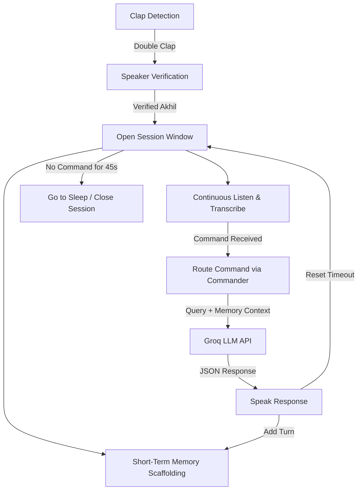

# ZYRION Project Notes

## Day 3 Progress: Session Window & Memory Scaffolding

### 1. Architecture Overview
Today we completed the session window flow and laid down the scaffolding for ZYRION's memory architecture.



---

### 2. Session Window (Awake State)
* **Goal**: Enable natural back-and-back conversations without requiring claps before every single prompt.
* **Implementation**:
  * A 45-second sliding timeout (`SESSION_TIMEOUT = 45`).
  * Once speaker verification passes, ZYRION enters a loop listening for voice commands.
  * Every successful command execution resets the session start timer.
  * If no command is heard (or a blank/short audio input is transcribed) within the timeout window, ZYRION says *"Going to sleep"* and goes back to double-clap listening.

---

### 3. Memory Architecture
We have structured the memory into three logical layers:

| Layer | File Path | Scope | Technology | Status |
| :--- | :--- | :--- | :--- | :--- |
| **Short-Term Memory** | `memory/short_term.py` | In-process session memory (wiped when session closes). Stores last 3 user + assistant turns. | `collections.deque` | **Done** |
| **Long-Term Memory** | `memory/long_term.py` | Persistent factual memory across days and restarts (e.g. facts about Akhil). | Qdrant + mem0 | *Day 4 Stub* |
| **Episodic Memory** | `memory/episodic.py` | Chronological session/event history log (what happened and when). | Local logs | *Day 4 Stub* |

#### Short-Term Memory Structure (`memory/short_term.py`)
Keeps a max-length `deque` of the last 6 messages (`MAX_TURNS = 6`) formatted as:
```json
[
  {"role": "user", "content": "What's the weather in Jaipur?"},
  {"role": "assistant", "content": "The weather in Jaipur is currently sunny and 32°C."}
]
```

---

### 4. Router / Commander Integration (`agents/commander.py`)
The main coordinator routing commands using Groq APIs:
* **System Prompt**: Instructs the LLM to analyze the request and route to sub-agents: `general`, `phone_control`, or `self_improvement`.
* **Format**: Enforces strict JSON output `{"agent": "<agent>", "reply": "<text>"}`.
* **Context**: Dynamically appends short-term memory history to LLM messages if active.

---

### 5. Future Roadmap (Day 4 & Beyond)
* Implement persistent vector-based memory (`Qdrant` and `mem0` integration).
* Implement episodic logging (`episodic.py`).
* Connect phone control and self-improvement sub-agents.
